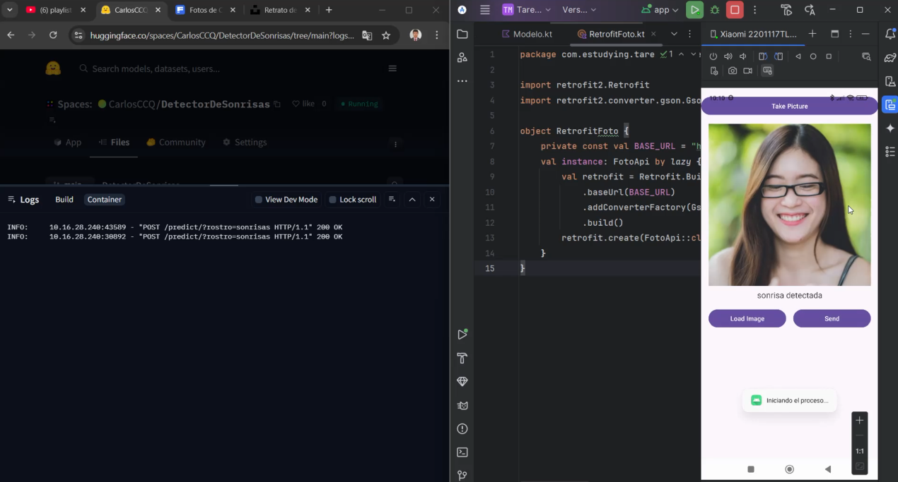

# Detector de Sonrisas – App Android + API en Hugging Face

Este proyecto consiste en una **aplicación Android** que permite tomar o cargar una foto, y enviarla a una **API desplegada en Hugging Face Spaces**. La API utiliza técnicas clásicas de **visión por computadora con OpenCV** para detectar si hay una **sonrisa en un rostro**.

Es un ejemplo práctico de cómo conectar una app móvil con un backend de procesamiento de imágenes en la nube.

---

## ¿Qué hace este proyecto?

1. El usuario toma una foto o la selecciona desde la galería.
2. La app convierte la imagen en un archivo JPEG y la envía a una API en la nube.
3. La API procesa la imagen con OpenCV y detecta:
   - Si hay un rostro
   - Si el rostro presenta una sonrisa
4. La app muestra en pantalla el resultado: `"sonrisa detectada"` o `"no se detectó sonrisa"`.

---

## Aplicación Android

La app está desarrollada en **Kotlin** y usa:

- Retrofit (para consumo de API)
- Camera / Galería
- ViewBinding

### Funcionalidades principales

- Tomar una foto con la cámara
- Cargar una imagen desde la galería
- Enviar la imagen a una API REST
- Mostrar el resultado de la detección en pantalla

Archivos clave:
- `MainActivity.kt` – Lógica principal de la app
- `RetrofitFoto.kt` – Configuración del cliente HTTP
- `FotoApi.kt` – Interfaz de comunicación con la API
- `Modelo.kt` – Modelos de datos para la respuesta

---

## API con FastAPI + OpenCV

Desarrollada con **FastAPI** y desplegada en **Hugging Face Spaces** usando Docker.

La API:

- Recibe imágenes JPEG como archivos (multipart/form-data)
- Usa clasificadores Haar de OpenCV para detectar rostros y sonrisas
- Devuelve un JSON con la predicción textual

Archivos clave:
- `app.py` – Código principal de la API
- `Dockerfile` – Para crear el contenedor en Hugging Face
- `requirements.txt` – Dependencias del proyecto

---

## URL del backend

La API está alojada en Hugging Face Spaces:

**URL base de la API**:  
`https://<tu-usuario>-detectordesonrisas.hf.space/`

---

## ¿Cómo probarlo?

### 1. Ejecutar la app Android

- Abre el proyecto en Android Studio
- Asegúrate de que esta línea tenga la URL de Hugging Face:

```kotlin
private const val BASE_URL = "https://<tu-usuario>-detectordesonrisas.hf.space/"
```

- Ejecuta la app en un emulador o dispositivo físico
- Prueba cargando una imagen o tomando foto
- Recibiras la predicción desde la API

## Tecnologías utilizadas

| Área        | Herramientas                     |
|-------------|----------------------------------|
| Backend     | Python, FastAPI, OpenCV          |
| Frontend    | Android (Kotlin), ViewBinding    |
| Comunicación| Retrofit, Multipart HTTP         |
| Imágenes    | PIL (Pillow), MediaStore, Bitmap |
| Otros       | Docker, CORS, Haar Cascades      |

## Permisos de la app

La aplicación solicita los siguientes permisos:

- `CAMERA:` para tomar fotos.
- `READ_EXTERNAL_STORAGE:` para acceder a la galería.

Se manejan dinámicamente y se solicita al usuario si no están habilitados.

## Resultados

Verificación de Hugging Face Space:


Imagen de persona con sonrisa:


Imagen de persona sin sonrisa:


No detecta de sonrisa:


Detecta sonrisa:



Usando la camara para detectar persona sin sonrisa:


